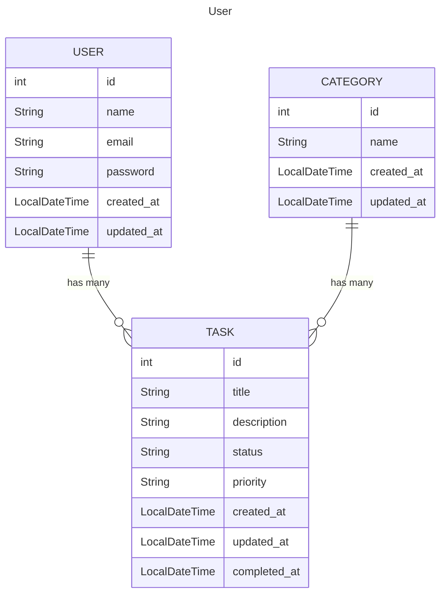

```mermaid
---
title: User
---

erDiagram
    USER {
        int id
        String name
        String email
        String password
        LocalDateTime created_at
        LocalDateTime updated_at
    }

    TASK {
        int id
        String title
        String description
        String status
        String priority
        LocalDateTime created_at
        LocalDateTime updated_at
        LocalDateTime completed_at
    }

    CATEGORY {
        int id
        String name
        LocalDateTime created_at
        LocalDateTime updated_at
    }

    USER ||--o{ TASK : "has many"
    CATEGORY ||--o{ TASK : "has many"

```